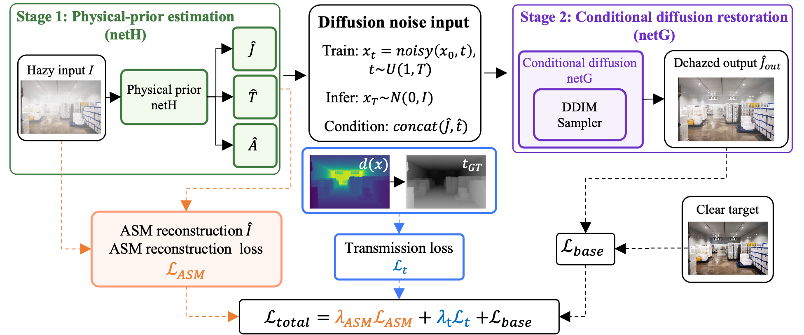
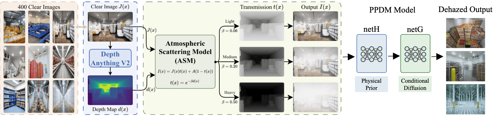

# PPDM — Physics-Prior Diffusion Model for Image Dehazing in Cold Storage Scenes

**PPDM**（Physics-Prior Diffusion Model）是一個面向**冷庫低溫霧化場景**的單圖像去霧模型。它以條件擴散去霧為骨幹，引入**物理先驗**（深度、透射率、大氣散射模型），專門解決冷庫中**由低溫水汽凝結形成的近距離、高濃度霧**所造成的去霧難題。

通用去霧模型在冷庫場景下存在明顯的域差（domain gap）：霧由低溫凝結而非遠景大氣造成，濃度高、空間分佈與一般戶外霧霾不同。PPDM 針對此問題提出：

- **冷庫物理合成資料集**：引入 [Depth Anything V2](https://github.com/DepthAnything/Depth-Anything-V2) 作為深度先驗，依大氣散射模型合成符合物理的霧化圖像，並按霧濃度分級（Light / Medium / Heavy）。
- **物理先驗注入與三層遞進訓練**：**只微調擴散主幹 netG → 聯合微調 netG + 條件網路 netH → 再加入物理損失（透射率 / 大氣散射一致性）**，讓生成結果同時受重建損失與物理約束監督。
- **高效推理與評測**：支援快速採樣器（DDIM、DPM-Solver++）、多 GPU 推理，並提供論文出圖與 SAM 下游分割評測。

> PPDM 的擴散骨幹與條件網路改造自 [DehazeDDPM](https://github.com/yuhuUSTC/DehazeDDPM)；本倉庫中的 `netG`（擴散主幹）、`netH`（條件 / PreNet）等命名沿用自該基線。

<p align="center">
  <br>
  <em>PPDM 整體架構。Stage 1 由 netH 估計物理先驗（透射率 t̂、大氣光 Â 等），Stage 2 為條件擴散 netG 還原清晰影像。訓練在原重建損失 𝓛<sub>base</sub> 之外，加入兩個物理約束：<strong>透射率損失 𝓛<sub>t</sub></strong> 與 <strong>ASM 大氣散射重建損失 𝓛<sub>ASM</sub></strong>，總損失 𝓛<sub>total</sub> = λ<sub>ASM</sub>·𝓛<sub>ASM</sub> + λ<sub>t</sub>·𝓛<sub>t</sub> + 𝓛<sub>base</sub>。</em>
</p>

---

## 目錄結構

| 路徑 | 內容 |
| --- | --- |
| `sr.py` | 訓練入口（`python sr.py --config <json>`）。 |
| `infer.py` | 推理 / 採樣入口，支援多 GPU 依樣本切分。 |
| `config/` | 所有實驗設定（訓練與測試）。命名見下方對照表。 |
| `model/` | PPDM 模型定義：擴散主幹 netG（`sr3_modules`、`ddpm_modules`）、條件網路 netH、物理損失（`model.py`）。 |
| `core/` | logger、metrics、wandb、seed 等工具。 |
| `data/` | 資料載入（`LRHR_dataset.py`）與資料集建構腳本。 |
| `data/dataset/` | **冷庫資料集建構說明與腳本**，見 [data/dataset/README.md](data/dataset/README.md)。 |
| `Diffusion_trained_pth/` | 第二階段擴散 checkpoint（已被 `.gitignore`，需另行取得）。 |
| `pretrained_PreNet_pth/` | 第一階段 PreNet（netH）權重。 |
| `experiments/` | 訓練輸出（logs / checkpoint / tb_logger，已被 `.gitignore`）。 |
| `plot/` | 論文（第五章）出圖與分析 notebook，見 [出圖與分析](#出圖與分析)。 |
| `sam_coldfog_test/` | SAM 下游分割評測子專案，見 [sam_coldfog_test/README.md](sam_coldfog_test/README.md)。 |
| `*.sh` | 各實驗的訓練 / 測試啟動腳本。 |

---

## 程式碼來源與外部依賴

PPDM 的完整工作流橫跨三個程式庫。資料集建構（深度估計）與下游評測（SAM）原本分別在 [Depth Anything V2](https://github.com/DepthAnything/Depth-Anything-V2) 與 [Segment Anything](https://github.com/facebookresearch/segment-anything) 的官方 repo 中執行；為了統一提交，本倉庫**只整理了與 PPDM 直接相關的關鍵腳本**（例如 `data/dataset/` 的合成腳本、`sam_coldfog_test/` 的評測腳本）。

因此，要完整重現本項目，你需要在本倉庫之外另外取得這兩個官方 repo：

| 步驟 | 程式碼位置 | 本倉庫內的對應說明 |
| --- | --- | --- |
| 去霧訓練 / 推理（PPDM 主體） | **本倉庫** | 本 README |
| 深度先驗 / 霧合成 | 另行 clone [Depth Anything V2](https://github.com/DepthAnything/Depth-Anything-V2) | [data/dataset/README.md](data/dataset/README.md) |
| SAM 下游分割評測 | 另行 clone [Segment Anything](https://github.com/facebookresearch/segment-anything) | [sam_coldfog_test/README.md](sam_coldfog_test/README.md) |

> 兩個子 README 內若出現本機絕對路徑（如 `/mnt/newdisk/.../Depth-Anything-V2`、`/mnt/newdisk/.../segment-anything`），請替換成你自己 clone 的位置。

## 環境配置

由於三個程式庫的依賴不同，建議**建立三個獨立的 conda 環境**（環境名稱可自訂，以下僅為建議）：

### 1. PPDM 去霧主環境

訓練與推理本去霧模型使用。

```bash
conda create -n ppdm python=3.10 -y
conda activate ppdm

pip install torch==2.1.2 torchvision==0.16.2 --index-url https://download.pytorch.org/whl/cu121

pip install tensorboardX wandb numpy opencv-python Pillow tqdm lmdb matplotlib
```

### 2. 深度估計環境（資料集建構）

跑 Depth Anything V2 產生深度先驗、合成冷庫霧時使用。**在 Depth Anything V2 的 repo 內**安裝其官方依賴：

```bash
conda create -n ppdm-depth python=3.10 -y
conda activate ppdm-depth

# 於 Depth-Anything-V2/ 目錄下
pip install -r requirements.txt
# 若使用 metric depth（本項目使用），再裝 metric_depth 的依賴
pip install -r metric_depth/requirements.txt
```

### 3. SAM 評測環境（下游評測）

跑 `sam_coldfog_test/` 的分割評測時使用。**在 Segment Anything 的 repo 內**安裝：

```bash
conda create -n ppdm-sam python=3.10 -y
conda activate ppdm-sam

# 於 segment-anything/ 目錄下
pip install -e .
pip install opencv-python pycocotools matplotlib onnxruntime onnx
```

指定 GPU 運行（主環境）：

```bash
CUDA_VISIBLE_DEVICES=3 bash testDENSE.sh
```

---

## 預訓練權重

PPDM 以 DehazeDDPM 的預訓練權重作為微調起點。僅在需要重現**基線**或從頭微調時才需下載：

- 第一階段 PreNet（netH）權重在 `pretrained_PreNet_pth/`。
- 第二階段擴散主幹 checkpoint 下載：[Diffusion_trained_pth](https://drive.google.com/drive/folders/1I7sH6vb9oWOZeIVu6-xh9Xm5lnwdzHa7?usp=drive_link)（DehazeDDPM 原作者提供）。

### PPDM Pretrained Checkpoint

PPDM 在冷庫資料上微調後的 checkpoint（`Diffusion_trained_pth/` 與 `experiments/` 內）未隨倉庫提供。可直接下載使用，或依下方訓練流程自行產生：

> 🔗 **下載連結：** _（TODO: 待補 —— PPDM 微調 checkpoint 上傳中，連結將更新於此）_

下載後將 checkpoint 放到對應目錄，並把 config 內 `path.resume_state`（推理時）指向其前綴（不含 `_gen.pth`）。

---

## 資料集

<p align="center">
  <br>
  <em>資料集構建總覽。約 400 張冷庫清晰影像經 Depth Anything V2 估計深度，再依大氣散射模型（ASM）按透射率合成 Light / Medium / Heavy 三級霧圖，作為 PPDM 的訓練與評測資料。</em>
</p>

### 下載

冷庫合成霧資料集（清晰圖、分濃度霧圖、split 與微調用扁平目錄）：

> 🔗 **下載連結：** _（TODO:待補 —— 資料集上傳中，連結將更新於此）_

下載後請解壓到專案的 `data/` 下，並依下方說明修改 config 內的路徑。

### 從頭建構

若要從原始清晰圖自行重建資料集，完整流程（清晰圖採集 → Depth Anything V2 深度 → 依大氣散射模型合成 Light/Medium/Heavy 霧 → split → 微調用扁平目錄）詳見：

**➡ [data/dataset/README.md](data/dataset/README.md)**

相關腳本：`data/dataset/synthesize_fog.ipynb`、`data/dataset/split.ipynb`、`data/dataset/prepare_finetune_data.py`、`data/prepare_data.py`。深度估計步驟需在 Depth Anything V2 repo 內、使用 `ppdm-depth` 環境執行。

> 各 config 內的 `datasets.*.dataroot`、`finetune_root`、`metadata_csv` 目前指向本機絕對路徑（例如 `/mnt/newdisk/.../data/finetune`）。在新機器上請依實際資料位置修改這些欄位。

---

## 訓練

訓練入口為 `python sr.py --config <json>`。以下路徑皆相對於專案根目錄、且需在根目錄執行。

### 三種微調設定

| 設定 / 啟動腳本 | config | 說明 |
| --- | --- | --- |
| `trainColdFog.sh` | `Dehaze_ColdFog_finetune.json` | **只微調擴散 netG**（netH 凍結）。 |
| `trainColdFogNetH.sh` | `Dehaze_ColdFog_finetune_netH.json` | **聯合微調 netG + netH**（`finetune_netH: true`，netH 用較小的 `lr_netH`，預設 `1e-5`）。 |
| `trainColdFogNetHPhysical.sh` | `Dehaze_ColdFog_finetune_netH_physical.json` | netG + netH **再加入物理損失**：透射率損失 `lambda_t` 與大氣散射模型損失 `lambda_asm`，總損失 = `l_pix + lambda_t·loss_t + lambda_asm·loss_asm`。驗證採 DDIM 20 步。需提供 `resume_stateH_finetune`（已微調的 netH 權重）與物理目標（`metadata_csv` / `finetune_root`）。 |

對應的接續訓練腳本：`trainColdFog_resume.sh`、`trainColdFogNetH_resume.sh`（後者把 netH 物理訓練續跑到 `n_iter=200000`）。

### 從頭訓練（新實驗目錄）

- **不要**在設定檔的 `path` 裡加入 `reuse_experiments_root`。程式會自動建立 `experiments/<name>_<時間戳>/`，並將 `logs`、`checkpoint`、`tb_logger` 等寫入該目錄。
- **`resume_state`**：填二階段擴散預訓練的**前綴**（不含 `_gen.pth`），例如 `./Diffusion_trained_pth/DENSE_I130000_E2600`。程式會載入 `..._gen.pth`。
- 若該前綴路徑**沒有**對應的 `..._opt.pth`（僅預訓練權重），則只載入網路權重，**iteration 從 0 開始**，屬預期行為。
- **`resume_stateH`**：第一階段 PreNet（netH）權重路徑（與原專案相同）。
- **`resume_stateH_finetune`**（僅 netH 物理設定用到）：已微調過的 netH 權重前綴 `..._netH.pth`，用來在物理階段接續 netH。

### 接續訓練（同一實驗目錄 + log 接續）

中斷後若要從**最近一次存檔**繼續跑到 `train.n_iter`（例如 100000），並讓 **`train.log` / `val.log` 接在舊檔後面**（不覆寫）：

1. 在 `path` 中設定 **`reuse_experiments_root`** 為既有實驗資料夾的**完整相對路徑**，例如：
   `experiments/Dehaze_ColdFog_finetune_only_diffusion_260417_152053`
2. 將 **`resume_state`** 改為該實驗下 `checkpoint` 裡**一組存檔的前綴**（同樣不含 `_gen.pth`），例如：
   `experiments/Dehaze_ColdFog_finetune_only_diffusion_260417_152053/checkpoint/I85000_E304`
3. 必須同時存在 **`I85000_E304_gen.pth`** 與 **`I85000_E304_opt.pth`**，才會還原 **optimizer** 以及 **`iter` / `epoch`**，訓練才會從該 iteration 繼續；若只有 `*_gen.pth`，行為等同只載權重並從 iter 0 重跑。
4. **`train.n_iter`** 仍為「總 iteration 上限」；接續時會從 checkpoint 記錄的 iter 繼續遞增，直到達到 `n_iter`。

**注意：** 存檔頻率由 `train.save_checkpoint_freq` 決定。若中斷發生在兩次存檔之間，磁碟上只有**上一個** checkpoint，接續後會從該點重跑中間未落盤的 iteration。TensorBoard 沿用同一 `tb_logger` 目錄時可能產生多個 event 檔，一般仍可一併檢視。

---

## 推理與採樣器設定

### 跑本項目資料集

```bash
conda activate ppdm

CUDA_VISIBLE_DEVICES=3 python infer.py --config ./config/test_DENSE_diy.json
CUDA_VISIBLE_DEVICES=2 python infer.py --config ./config/test_NH_diy.json
```

冷庫微調模型的測試 config 與啟動腳本對照：

| 採樣器 | config | 腳本 |
| --- | --- | --- |
| 完整 DDPM（品質 baseline，2000 步） | `test_ColdFog_finetune.json` | `testColdFogFinetune.sh` |
| DDIM | `test_ColdFog_finetune_ddim.json` | `testColdFogFinetune_ddim.sh` |
| DPM-Solver++ | `test_ColdFog_finetune_dpm_solver_pp.json` | `testColdFogFinetune_dpm_solver_pp.sh` |
| netH 模型 | `test_ColdFog_finetune_netH.json` | `testColdFogFinetune_netH.sh` |
| netH + 物理（DDIM 20 步） | `test_ColdFog_finetune_netH_physical_ddim20.json` | `testColdFogFinetune_physical_ddim20.sh` |

### `beta_schedule.val` 採樣器設定

僅當 **`model.which_model_G` 為 `"sr3"`** 時，`GaussianDiffusion.super_resolution()` 會依設定切換採樣器；`ddpm` 路徑仍為完整反向鏈，與既有 checkpoint 相容。

設定寫在 JSON 的 **`model.beta_schedule.val`**（與 `schedule`、`n_timestep`、`linear_start`、`linear_end` 同層）。**訓練**仍只使用 **`beta_schedule.train`**，不需也不應在 `train` 區塊加 `sampler`。

| 欄位 | 說明 |
|------|------|
| **`sampler`** | 選採樣器：省略或省略整個鍵行為時，在載入 **僅含 train 的 schedule**（例如 `sr.py` 驗證後切回 train）會重設為 **`ddpm`**。可選字串（不分大小寫）：**`ddpm`**（完整 \(T\) 步）、**`ddim`**、**`dpm_solver_pp`**（亦可寫 **`dpm_solver++`**，程式會正規化成底線形式）。 |
| **`sample_steps`** | **僅對 `ddim` / `dpm_solver_pp` 有意義**。從完整時間表（長度為 **`n_timestep`**）做跳步採樣的目標步數；**不要**為了加速而把 **`val.n_timestep`** 改成遠小於訓練時的步數來冒充少步推理（會破壞與訓練一致的 \(\bar\alpha\) 離散化）。若省略：**`ddim` 預設 100**，**`dpm_solver_pp` 預設 50**。**`ddpm`** 會忽略此欄，固定跑 **`n_timestep`** 步。 |
| **`ddim_eta`** | **僅 `ddim` 使用**。\( \eta = 0 \) 為確定性 DDIM；\( \eta > 0 \) 會注入隨機性（類 DDPM）。預設可設 **`0.0`**。 |

**範例片段（DDIM，100 步）：**

```json
"val": {
  "schedule": "linear",
  "n_timestep": 2000,
  "linear_start": 1e-6,
  "linear_end": 1e-2,
  "sampler": "ddim",
  "sample_steps": 100,
  "ddim_eta": 0.0
}
```

**範例片段（DPM-Solver++，50 步）：**

```json
"val": {
  "schedule": "linear",
  "n_timestep": 2000,
  "linear_start": 1e-6,
  "linear_end": 1e-2,
  "sampler": "dpm_solver_pp",
  "sample_steps": 50
}
```

**採樣器調參建議：**

- **DDIM / DPM-Solver++ 不需要重新訓練。** 它們只改變驗證／推理時的反向採樣方式，不引入新的可訓練參數；後續訓練仍保持 `beta_schedule.train` 原設定即可。
- **不要為了加速改小 `val.n_timestep`。** `n_timestep`、`linear_start`、`linear_end` 應與訓練 schedule 保持一致，例如本專案 finetune 設定為 `2000 / 1e-6 / 1e-2`。少步推理請只調 `sample_steps`。
- **DPM-Solver++ 優先調 `sample_steps`。** 目前程式中 `order=2`、`skip_type='time_uniform'`、`clip_denoised=True` 是固定的；若 50 步結果有噪點，建議依序測 `75`、`100`、`150`、`200`，通常步數增加會提升穩定性但推理更慢。
- **DDIM 建議先用確定性設定。** `ddim_eta: 0.0` 通常更穩；若影像已有噪點，不建議先增大 `ddim_eta`，因為 `eta > 0` 會額外注入隨機性。可對照測 `sample_steps: 100` 與 `200`。
- **實驗比較建議。** 用完整 DDPM（`ddpm`，2000 步）作為品質 baseline，再比較 `DPM-Solver++ 50/100/150`、`DDIM 100/200` 的 PSNR、SSIM 與視覺效果；若高步數仍有明顯噪點，問題更可能來自模型權重、冷庫資料分佈或第一階段 `netH` 條件圖品質，而不是採樣器本身。

**程式入口對應：** `sr.py` 在驗證階段會載入 `beta_schedule.val`；`infer.py` 亦使用 **`beta_schedule.val`** 做推理。

### `infer.py` 多 GPU 推理（依樣本切分）

當設定檔中 **`gpu_ids` 超過一張**（例如 `[0, 1]`），或使用 **`python infer.py ... -gpu 0,1`** 時，程式會以 **`torch.multiprocessing.spawn`** 為每張可見 GPU 啟動一個進程，並將驗證集按 **樣本索引交錯切分**（rank `r` 處理索引 `r, r+W, r+2W, ...`）。每個進程各自載入完整模型並綁定 **`cuda:{local_rank}`**，且會將 **`distributed` 設為 False**，避免子進程再包一層 `DataParallel`。

- **輸出檔名**：使用資料集中的 **`Index + 1`** 作為檔名中的序號（與單卡時「第 k 張圖對應 `{step}_{k+1}_*.png`」一致），多進程並行寫入同一 `results` 目錄時不會互相覆蓋。
- **整體 PSNR**：主進程依各 worker 回傳的樣本加權平均彙總。
- **日誌**：各 GPU 的細節寫入 **`logs/infer_rank{0,1,...}.log`**；主進程終端仍會印出總平均 PSNR。
- **W&B**：多 GPU 模式下若開啟 **`log_infer`**，為避免多進程重複上傳，**會跳過**逐張 `log_eval_data`／表格；若需要完整 W&B 推理紀錄請改用 **單卡**。

範例：

```bash
bash testColdFogFinetune_ddim.sh -gpu 0,1
# 或在 JSON 中設定 "gpu_ids": [0, 1] 後直接：
python infer.py --config config/test_ColdFog_finetune_ddim.json
```

---

## 出圖與分析

`plot/` 收錄論文（第五章）的圖表與分析 notebook：

| 路徑 | 內容 |
| --- | --- |
| `plot/plot_train_log.ipynb` | 由 `train.log` / `val.log` 繪製訓練曲線。 |
| `plot/compare_checkpoints_testset.ipynb` | 不同 checkpoint 在測試集上的指標對照。 |
| `plot/ch5_main_results/` | 主結果圖。 |
| `plot/ch5_ablation/` | 消融實驗圖。 |
| `plot/ch5_inference/` | 推理 / 採樣器對照圖。 |
| `plot/ch5_zero_shot_failure_cases/` | 原始模型 zero-shot 失敗案例。 |
| `plot/build_test_metadata.py`、`plot/test_metadata.json` | 測試集 metadata 建構。 |

---

## 下游評測（SAM）

在冷庫去霧結果上以 Segment Anything（SAM）做自動分割評測，量化去霧對下游分割的幫助。流程、GPU 設定與腳本說明見：

**➡ [sam_coldfog_test/README.md](sam_coldfog_test/README.md)**（使用 `ppdm-sam` 環境，並需另行 clone Segment Anything repo）

---

## 致謝與引用

PPDM 的擴散去霧骨幹基於 [DehazeDDPM](https://github.com/yuhuUSTC/DehazeDDPM)，物理先驗使用 [Depth Anything V2](https://github.com/DepthAnything/Depth-Anything-V2)，下游評測使用 [Segment Anything](https://github.com/facebookresearch/segment-anything)。感謝以上工作的作者。

<!-- 若本倉庫對你的研究有幫助，請引用對應報告：

> **Physics-Prior Diffusion Model for Image Dehazing in Cold Storage Scenes (PPDM).** -->
